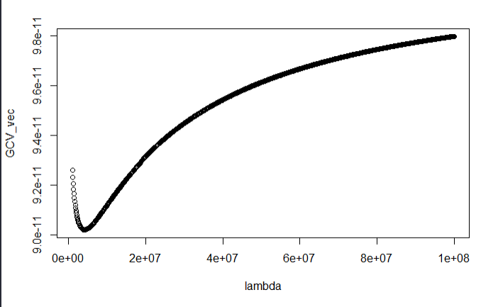

```{r setup, include=FALSE}
knitr::opts_chunk$set(echo = TRUE)
```

# 필요한 패키지
```{r message=FALSE, warning=FALSE}
#for data
library(tidyverse)
library(tidyr)
library(devtools)
library(MASS)
library(lubridate)
library(quantmod)
library(PerformanceAnalytics)
library(magrittr)
library(dplyr)
library(data.table)

# for graph
library(ggplot2)
library(dygraphs)
library(highcharter)

# for model
library(pscl)
```


```{r message=FALSE, warning=FALSE, include=FALSE}
#multilevel splines package in Github
devtools::install_github("ydhwang/mlsplines", force = T)
```

\newpage

# 데이터
- Y data : Y데이터의 경우 120달(2009년 1월 ~ 2018년 12월)동안의 한국에 입국한 국적별 외국인 수를 나타냈다.

- X data :  X데이터의 경우 120달 동안의 각 나라의 한국 원화 기준 환율을 나타낸 것이다. 나라는 한글 순으로 [가나, 가봉, … , 헝가리, 호주, 홍콩] 174개국으로 구성했으며, 시간의 흐름에 따라 데이터를 나열했다.

```{r message=FALSE, warning=FALSE, include=FALSE}
# Y data
alldata <- fread("~\\Github\\main\\main\\fordata22.csv")

alldata$Month <- parse_date_time(alldata$Month, "ym")
alldata$Month <- as.Date(alldata$Month, format="%Y-%m-%d")
alldata <- as.data.frame(alldata)
alldata <- alldata %>% mutate_if(is.character,parse_number)


# X data
exr <- fread("~\\Github\\main\\main\\exr22.csv")
exr$Month <- parse_date_time(exr$Month, "ym")
exr$Month <- as.Date(exr$Month, format="%Y-%m-%d")
exr <- as.data.frame(exr)
exr <- exr %>% mutate_if(is.character,parse_number)
```

# 데이터 정리 및 Goodness of fit test를 통한 적절한 모델 찾기

- X, Y 데이터 모두 리스트화를 거쳤다. Y데이터가 허들모델이라는 가정으로 각 행마다 0이 얼마나 포함되어 있는지 알아보았다. 
- 그 결과 32, 71, 94, 100, 104, 112, 113행에는 0을 포함하지 않아서 허들모델이나 zero inflated 방법을 이용하여 모델을 적합할 수 없었다. 
- 그래서 우리는 Goodness of Fit(GoF)를 이용하여 일반화 선형모형의 적합도를 검정해보았다.
```{r}
y_list <- alldata[,-1] %>% t() %>% as.data.frame() %>% as.list()
x_list <- exr[,-1] %>%  t() %>% as.data.frame() %>% as.list()

#How many zero in y_list?
y_list <- alldata[,-1] %>% t() %>% as.data.frame()
y_zero <- NULL
for(m in 1:120){
  zero <- NULL
  zero <- length(which(y_list[m] == 0))/174
  y_zero <- rbind(y_zero,zero)

  zero_count <- length(which(y_zero == 0))
  zero_where <- which(y_zero == 0)
  zero_count
  zero_where
}
zero_count
```
\newpage
## GoF 결과

- 그 결과 포아송 GoF는 모두 0으로 나왔으며, 음이항분포 GoF는 낮은 값을 보였다. 즉, 포아송분포를 사용하였을 때 과대산포가 발생하므로, 음이항분포를 이용하여 모형적합을 시도했다.
```{r}
#GOF Calculate
goodness <- NULL
  for(m in 1:120){
    result1_out <- NULL
    result2_out <- NULL
    results1 <- glm(unlist(y_list[m]) ~ unlist(x_list[m]), family = poisson)
    results2 <- glm.nb(unlist(y_list[m]) ~ unlist(x_list[m]))

    poi_GOF <- 1 - pchisq(summary(results1)$deviance,
           summary(results1)$df.residual
           )
    nb_GOF <- 1 - pchisq(summary(results2)$deviance,
           summary(results2)$df.residual
           )
    out <- cbind(poi_GOF,nb_GOF)
    goodness <- rbind(goodness, out)
  }

goodness
```


# Multilevel 모델에 적용

- 논문의 방법인 EM알고리즘을 통해 multilevel spline 방법으로 최적의 $\mu$ 벡터를 찾았다.
```{r}
#multilevel

  #beta_hat_vector 구하기
  grain_out <- NULL
  J=120
  beta_hat <- NULL
  for(m in 1:120){
    result2_out <- NULL
    results2 <- glm.nb(unlist(y_list[m]) ~ unlist(x_list[m]))
      kth_beta_hat <- coef(results2)[2]
      kth_var <- diag(vcov(results2))[2]
      grain_out <- list(kth_beta_hat, kth_var)
      grain_out
    beta_hat <- rbind(beta_hat,grain_out)
  }

# x, y를 다시 리스트화
x_list <- exr[,-1]
x_list <- x_list[colSums(is.na(x_list))<nrow(x_list)] %>% t() %>% as.data.frame() %>% as.list()

y_list <- alldata[,-1] 
y_list <- y_list[colSums(is.na(y_list))<nrow(y_list)] %>% t() %>% as.data.frame() %>% as.list()
```

## x_list 최소값, 최대값 추출
```{r}
# x의 범위로 make_K만들기
aaa <- unlist(x_list)
aaa <-  ifelse(is.na(aaa), mean(aaa, na.rm=TRUE), aaa)
min_x <- min(aaa)
max_x <- max(aaa)

      for(u in 1:120){
      z <- seq(min_x, max_x, length.out = 120)
      K <- mlsplines::make_K(z)
      }
```

## 최적의 GCV_vec 찾기
```{r}
lambda <- c(10^5, 10^6, 10^7, 10^8, 10^9)
  GCV_vec <- NULL

  for(i in 1:length(lambda)){
  EM_out <- mlsplines::main_EM(beta_hat_vec = unlist(beta_hat[,1]), V = diag(unlist(beta_hat[,2])), K = K, lambda[i])
  GCV_vec <- rbind(GCV_vec,EM_out$GCV)
  }
```

- lambda[which.min(GCV_vec)]을 실행할 때, 10^7이 나온다. 
- 그래서 10^7근처에서 GCV벡터를 더 찾아보기로 한다.

```{r}


lambda <- seq(10^6, 2e+07, by=10^6)
  GCV_vec <- NULL

  for(i in 1:length(lambda)){
  EM_out <- mlsplines::main_EM(beta_hat_vec = unlist(beta_hat[,1]), V = diag(unlist(beta_hat[,2])), K = K, lambda[i])
  GCV_vec <- rbind(GCV_vec,EM_out$GCV)
  }
  
plot(lambda, GCV_vec)
```

- 좀더 상세한 값을 위해 계속해서 찾는다.

```{r}
lambda <- seq(2e+6, 6e+6, by=10^5)
  GCV_vec <- NULL

  for(i in 1:length(lambda)){
  EM_out <- mlsplines::main_EM(beta_hat_vec = unlist(beta_hat[,1]), V = diag(unlist(beta_hat[,2])), K = K, lambda[i])
  GCV_vec <- rbind(GCV_vec,EM_out$GCV)
  }
  
plot(lambda, GCV_vec)
```

- 최적의 GCV_vec로 EM_out구하기 <- mu_hat 구함
```{r}
EM_out <- mlsplines::main_EM(beta_hat_vec = unlist(beta_hat[,1]), V = diag(unlist(beta_hat[,2])), K = K, lambda = lambda[which.min(GCV_vec)])
EM_out$mu
```

\newpage
# Naive Method(from "ydhwang/mlsplines" in Github)

- Multilevel과 성능을 비교하기위해서 Naive한 방법으로 구해보자.
```{r}
#naive
GCV_vec <- NULL
lambda <- c(10^7,10^8,10^9,10^10,10^11)
for(i in 1:length(lambda)){
  naive_out <- mlsplines::naive_ss(beta_hat_vec = unlist(beta_hat[,1]), lambda = lambda[i], K = K)
  GCV_vec <- rbind(GCV_vec,naive_out$GCV)
}

lambda[which.min(GCV_vec)]
```
## Naive's GCV vector 찾기
- Naive 역시 비슷한 방법으로 풀어나간다.
```{r}
GCV_vec <- NULL
lambda <- seq(10^7,10^9,by=10^7)
for(i in 1:length(lambda)){
  naive_out <- mlsplines::naive_ss(beta_hat_vec = unlist(beta_hat[,1]), lambda = lambda[i], K = K)
  GCV_vec <- rbind(GCV_vec,naive_out$GCV)
}
lambda[which.min(GCV_vec)]

plot(lambda, GCV_vec)

naive_out <- mlsplines::naive_ss(beta_hat_vec = unlist(beta_hat[,1]), lambda = lambda[which.min(GCV_vec)], K = K)

naive_out$mu
```

# 그래프

```{r}
# hat_all
single_beta <- unlist(beta_hat[,1]) %>% as.vector()
mu_z_naive <- naive_out$mu %>% as.vector()
mu_z_multi <- EM_out$mu %>% as.vector()

hat_all <- cbind(mu_z_naive,mu_z_multi,single_beta) %>% as.data.frame

test_mon <- fread("~\\Github\\main\\main\\fordata22.csv")
test_mon <- test_mon[,1]
hat_all <- cbind(test_mon,hat_all)

hat_all$Month <- parse_date_time(hat_all$Month, "ym")
hat_all$Month <- as.Date(hat_all$Month, format="%Y-%m-%d")
hat_all <- as.data.frame(hat_all)
hat_all <- hat_all %>% mutate_if(is.character,parse_number)

# gather 사용
df1 <- gather(hat_all[, c("Month", "mu_z_naive", "mu_z_multi")],
             key = "Method", value = "mu_z", -Month)

df2 <- cbind(test_mon,single_beta)
df2$Month <- parse_date_time(df2$Month, "ym")
df2$Month <- as.Date(df2$Month, format="%Y-%m-%d")
df2 <- as.data.frame(df2)
df2 <- df2 %>% mutate_if(is.character,parse_number)


g <- ggplot(df1) +
  geom_line(aes(x = Month, y = mu_z, color = Method, linetype = Method)) +
  geom_point(data=df2, aes(x = Month, y = single_beta, color = "single_beta")) +
  guides(linetype = "none") +
  scale_color_discrete(name = "Method")
g

```

